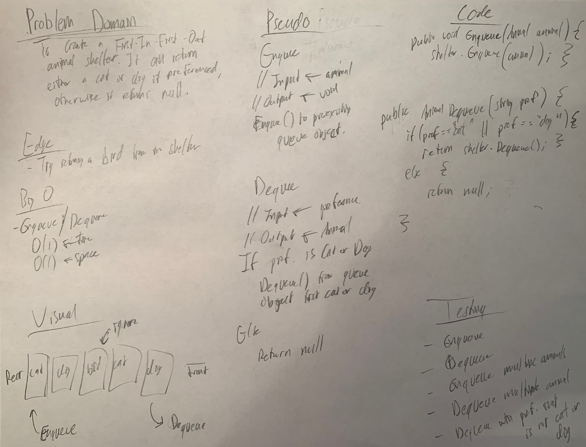

# FIFO Animal Shelter

*Author: Peyton Cysewski*

---

### Problem Domain
Create and animal shelter (primarily for cats and dogs) that operates with a FIFO ordering.

---

### Inputs and Expected Outputs

#### Enqueue
| Initial State | Input | Expected Output |
| :----------- | :----------- | :--------- |
| `Null` | `Dog` | `Dog` |
| `Dog -> Dog -> Dog` | `Cat` | `Cat -> Dog -> Dog -> Dog` |

#### Dequeue
| Initial State | Input | Expected Output |
| :----------- | :----------- | :--------- |
| `Cat -> Dog -> Dog -> Dog` | `"Dog"` | `Dog` |
| `Cat -> Dog -> Dog -> Dog` | `"Bird"` | `Null` |

---

### Big O

| Time | Space |
| :----------- | :----------- |
| O(1) | O(1) |

---

### Whiteboard Visual

---

### Change Log
1.1: *Initial Release* - 121 July 2020  

---