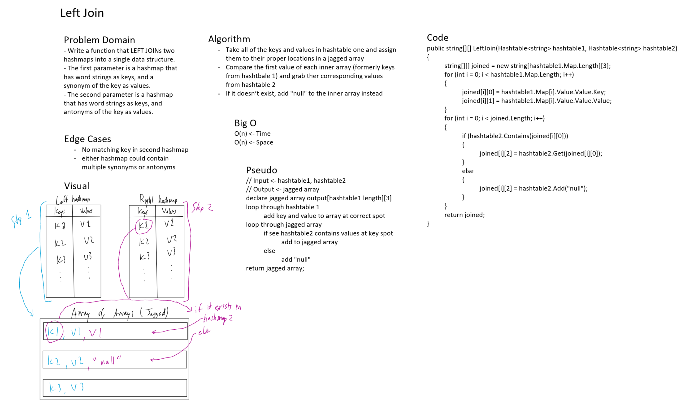

# Left Join

*Author: Peyton Cysewski*

---

### Challenge
- Write a function that LEFT JOINs two hashmaps into a single data structure.
- The first parameter is a hashmap that has word strings as keys, and a synonym of the key as values.
- The second parameter is a hashmap that has word strings as keys, and antonyms of the key as values.
- Combine the key and corresponding values (if they exist) into a new data structure according to LEFT JOIN logic.
- LEFT JOIN means all the values in the first hashmap are returned, and if values exist in the “right” hashmap, they are appended to the result row. If no values exist in the right hashmap, then some flavor of NULL should be appended to the result row.
- The returned data structure that holds the results is up to you. It doesn’t need to exactly match the output below, so long as it achieves the LEFT JOIN logic.
- Avoid utilizing any of the library methods available to your language. 

---

### Inputs and Expected Outputs

| Synonym Hashmap | Antonym Hashmap | Left Join Result |
| :----------- | :----------- | :--------- |
| Key: `"Happy"` Value: `"Joyful"` | Key: `"Happy"` Value: `"Sad"` | `[ "Happy", "Joyful", "Sad" ]` |
| Key: `"Happy"` Value: `"Joyful"` | Key: `"Not Happy"` Value: `"Irrelevant"` | `[ "Happy", "Joyful", "Null" ]` |

---

### Approach
Since a left join is predicated on the left side of a set of two things, the first step was to populate the right hashtable into a data structure that could hold another value when the right side was joined to it. I did not have to worry about the sixe because by definition any right-side values that are not in the left side would be ignored. The next step is very simple, if the key from the left also exists in the right table, then I add it to the new data structure and if it doesn't then I will just fill it with a placeholder such as a string that literally says "null". This results in a data set with a set of lists that contains the key, the value from the left side, and the possible option from the right side or a placeholder signifying it didn't exist.

---

### Big O
| Time | Space |
| :----- | :----- |
| O(n) | O(n) |

---

### Whiteboard Solution

---

### Change Log
1.1: *Revised* - 22 August 2020
1.0: *Initial Release* - 20 August 2020
