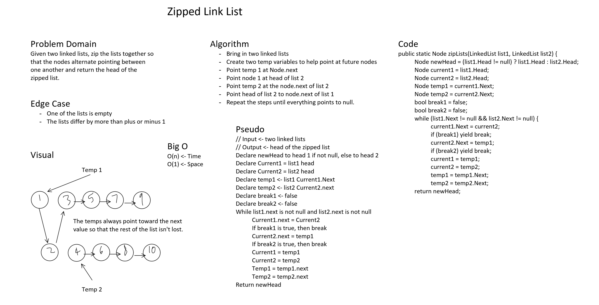

# Zipped Linked List

## ArrayShift
*Author: Peyton Cysewski*

---

### Problem Domain

Given two linked lists, zip the lists together so that the nodes alternate pointing between one another to create a single, large list. Return the head of the single zipped list.

---

### Inputs and Expected Outputs

| Arg ```list1``` | Arg ```list2``` | Expected Output |
| :----------- | :----------- | :----------- |
| ```1 -> 3 -> 5 -> null``` | ```2 -> 4 -> 6 -> null``` | ```1 -> 2 -> 3 -> 4 -> 5 -> 6 -> null``` |
| ```1 -> 3 -> 5 -> null``` | ```2 -> 4 -> 6 -> null``` | ```1 -> 2 -> 3 -> 4 -> 5 -> 6 -> null``` |
| ```1 -> 3 -> 5 -> null``` | ```2 -> 4 -> 6 -> null``` | ```1 -> 2 -> 3 -> 4 -> 5 -> 6 -> null``` |
| ```1 -> 3 -> 5 -> null``` | ```2 -> 4 -> 6 -> null``` | ```1 -> 2 -> 3 -> 4 -> 5 -> 6 -> null``` |
| ```1 -> 3 -> 5 -> null``` | ```2 -> 4 -> 6 -> null``` | ```1 -> 2 -> 3 -> 4 -> 5 -> 6 -> null``` |

---

### Big O


| Time | Space |
| :----------- | :----------- |
| O(1) | O(n) |


---


### Whiteboard Visual



---

### Change Log
1.1: *Initial Release* - 7 July 2020  

---