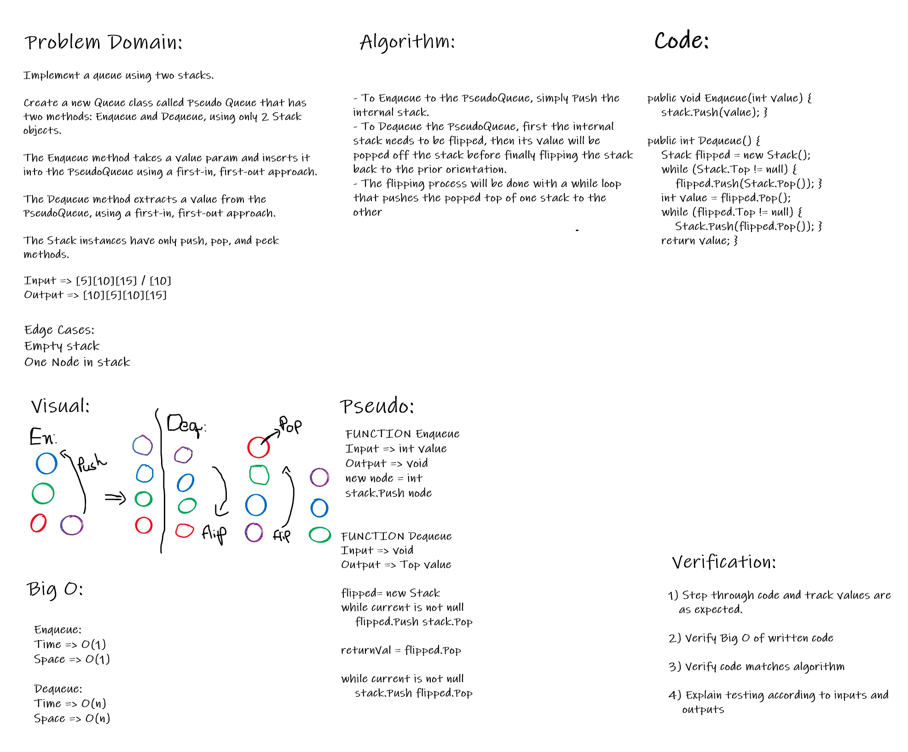

# Stacks with Queues

*Author: Peyton Cysewski*

---

### Problem Domain
Create a brand new `PseudoQueue` class. Do not use an existing Queue. Instead, this PseudoQueue class will implement our standard queue interface (the two methods listed below), but will internally only utilize 2 `Stack` objects. Ensure that you create your class with the following methods:

- `enqueue(value`) which inserts value into the PseudoQueue, using a first-in, first-out approach.
- `dequeue()` which extracts a value from the PseudoQueue, using a first-in, first-out approach.

The `Stack` instances have only `push`, `pop`, and `peek` methods. You should use your own Stack implementation. Instantiate these Stack objects in your PseudoQueue constructor.

---

### Inputs and Expected Outputs

#### Enqueue
| Input | Args | Output |
| :----------- | :----------- |
| `4 -> 3 -> 2 -> 1` | `5` | `5 -> 4 -> 3 -> 2 -> 1` |
| `null` | `5` | `5` |
#### Dequeue
| Input | Output | Internal State |
| :----------- | :----------- |
| `5 -> 4 -> 3 -> 2 -> 1` | `1` | `5 -> 4 -> 3 -> 2` |
| `5 -> 4 -> 3 -> 2` | `2` | `5 -> 4 -> 3` |

---

### Big O

#### Enqueue
| Time | Space |
| :----------- | :----------- |
| O(1) | O(1) |

#### Dequeue
| Time | Space |
| :----------- | :----------- |
| O(n) | O(n) |

---

### Whiteboard Visual

---

### Change Log
1.1: *Initial Release* - 20 July 2020  

---