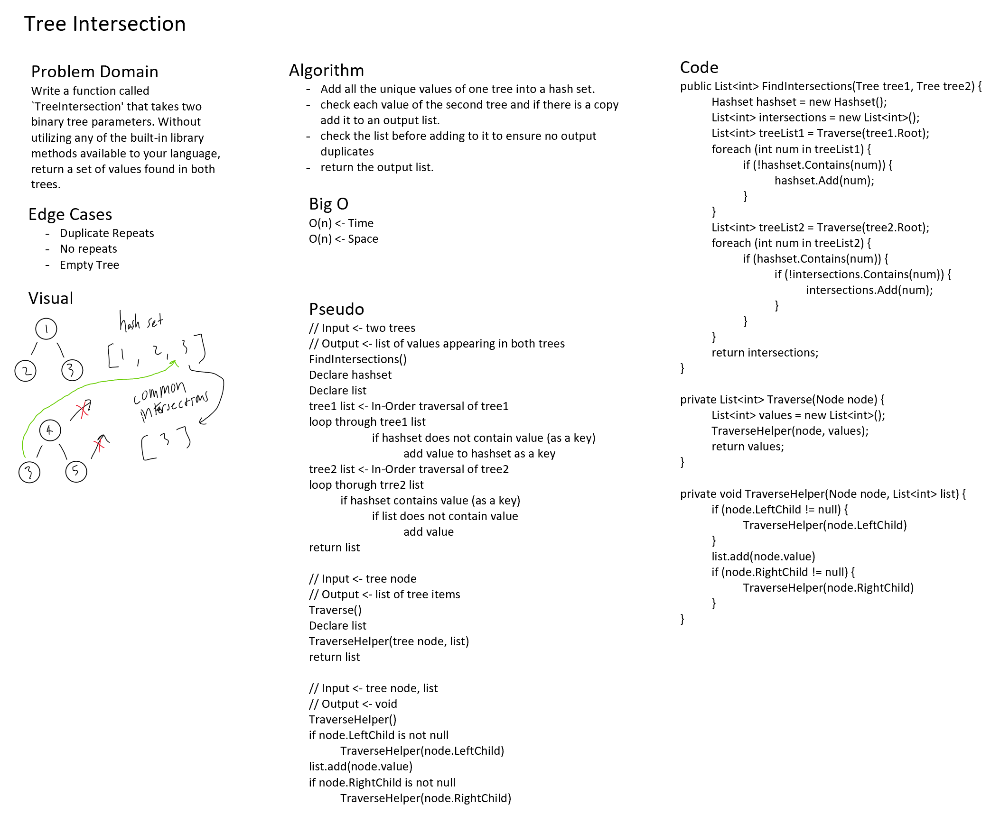

# Tree Intersection

*Author: Peyton Cysewski*

---

### Problem Domain
Write a function called `TreeIntersection' that takes two binary tree parameters. Without utilizing any of the built-in library methods available to your language, return a set of values found in both trees.
---

### Inputs and Expected Outputs

| Input | Expected Output |
| :----------- | :----------- |
| Tree 1 containing values:`1, 2, 3, 4, 5`, Tree 2 containing values: `9, 8, 7, 6, 5, 4` | List containing: `5, 4` |

---

### Big O
| Time | Space |
| :----- | :----- |
| O(n) | O(n) |

---

### Whiteboard Visual

---

### Change Log
1.0: *Initial Release* - 19 August 2020
