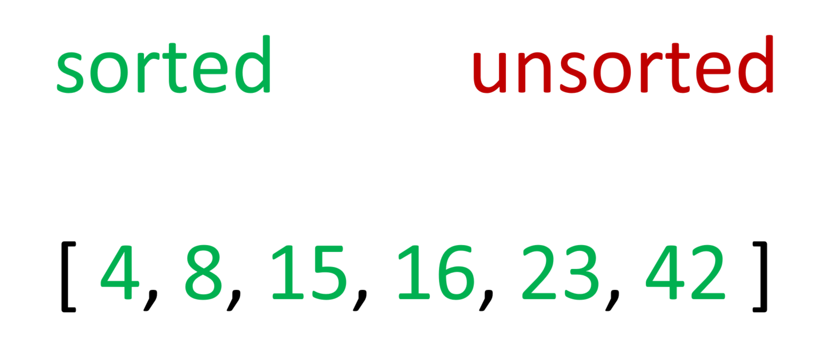

# Insertion Sort

The logic of insertion sort is relatively straightforward in terms of sorting algorithms overall. The goal is to compare two numbers, first starting with the first number in an array. The algorithm will move the smaller number to the left so that those two numbers are in ascending order. The next step is to look at the next two numbers and repeat. However, this time the number that was moved to the left also need to compare to the number that is currently residing to its left at the start of the array just in case they too need to be placed in the right order. Each time iterating through, the number of correctly ordered numbers increases by one and they are all grouped on the left side of the array. A partition is essentially formed through this process where every number to its left is sorted while the numbers to its right still need to be sorted. Once this partition has 'moved' to the right end of the array, it can be assumed that the entire array is sorted. 

Below is a step by step walkthrough of each 'cycle' of partitioning to demonstrate how this algorithm would sort an array. The partition is the imaginary barrier between the green and red numbers indication which numbers have been sorted and which have not.

### First Iteration

The 4 and the 8 are compared and they need to swap postions since they are not already in ascending order. Since 4 is the left number, it is part of the sorted partition. This iteration is complete so the algorithm moves to the next set of numbers.

### Second Iteration

The 8 and 23 are already in the correct order, so nothing changes. The 4 and 8 are compared again, but since they are already ordered correctly they do not change either.

### Third Iteration

The 23 and the 42 are already in the correct order, so they do not swap. No other number to the left of the 23 is bigger than it so it never changes positions with any other number.

### Fourth Iteration

In this iteration, the 42 and 15 need to swap because they are out of order. The 15 is then compared to its leftward number which would be 23. These numbers are also out of order so they swap. Finally, when 15 is compare to its leftward number of 8, the order is correct so the iteration ends.

### Fifth Iteration

The rightmost element of the array of numbers, 16, is compared to 42 and they have to swap. Similar to the iteration prior, the 16 will compare and swap its way all the way until it is next to 15 until the iteration is complete.

### Final Result

The whole time, the while the smaller numbers were moving to the left, the bigger numbers would desireably be moving to the right. Because of this, the largest number will always end up at the rightmost position after only N minus 1 steps. Therefore, the result was complete after the prior iteration due to the nature of how the numbers were shifted around.