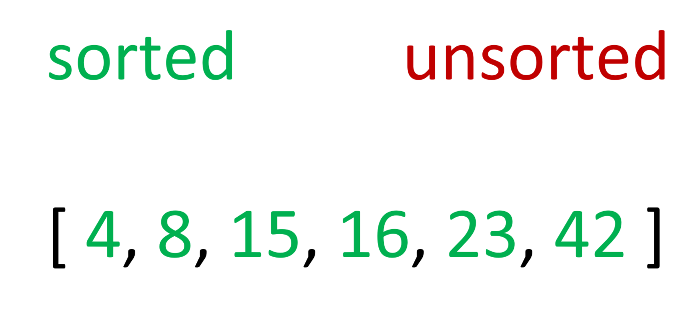

# Insertion Sort Algorithm

*Author: Peyton Cysewski*

---

## Description
Insertion sort is a sorting algorithm that compares a value to its leftward neighbor and moves it left if it is smaller. It repeats this process until the value can no longer move to the left. The algorithm then repeats those steps with the next number in the list until it too cannot move to the left. Once the algorithm has iterated thorugh the entire list, then it will be sorted.

---

## Big O

| Time | Space | Input | Outcome |
| :----------- | :----------- | :-------------: | :-------------: |
| O(n^2) | O(1) | `[ 8, 4, 23, 42, 16, 15 ]` | `[ 4, 8, 15, 16, 23, 42 ]` |

---

## Visuals

### First Iteration

 

### Second Iteration

 

### Third Iteration

 

### Fourth Iteration

 

### Fifth Iteration

 

### Final Result

---

## Change Log
1.1: *Initial Release* - 10 August 2020