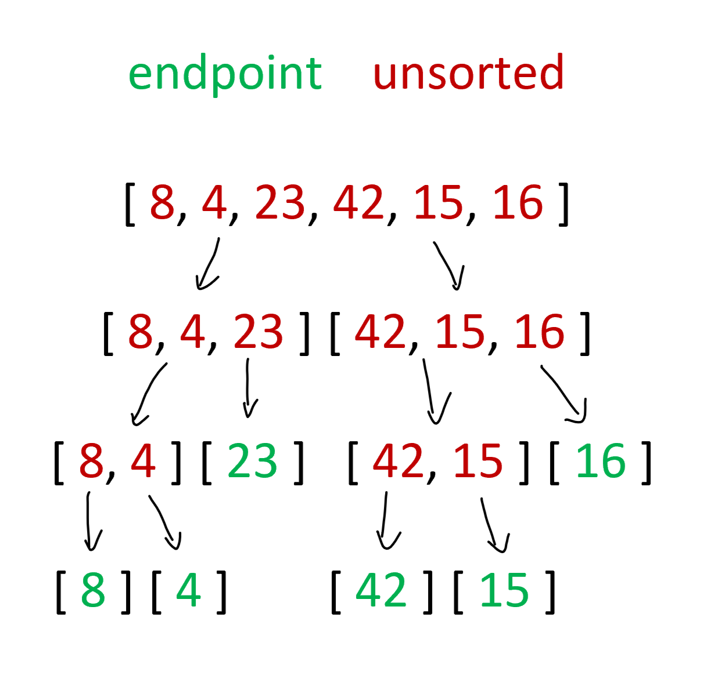
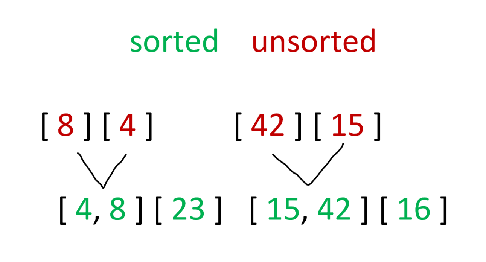
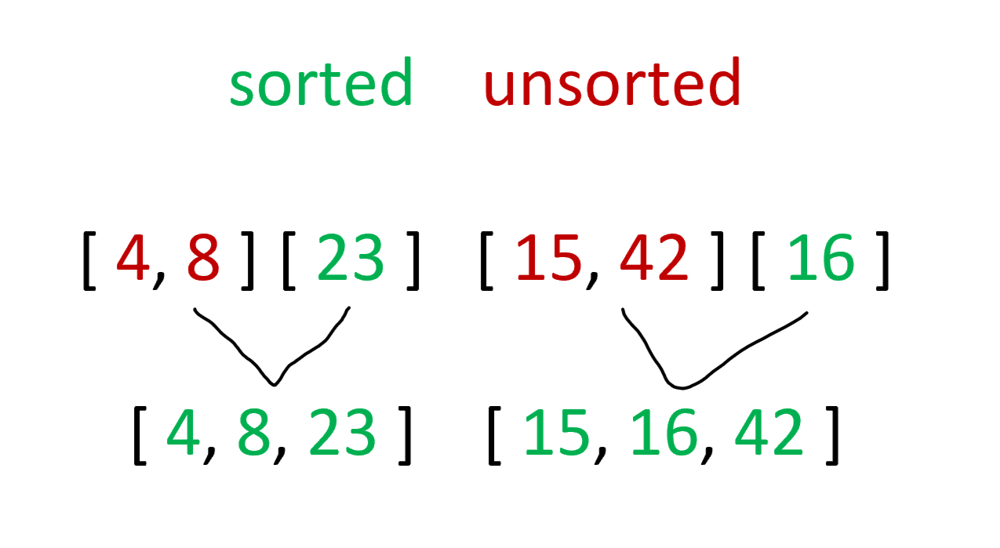
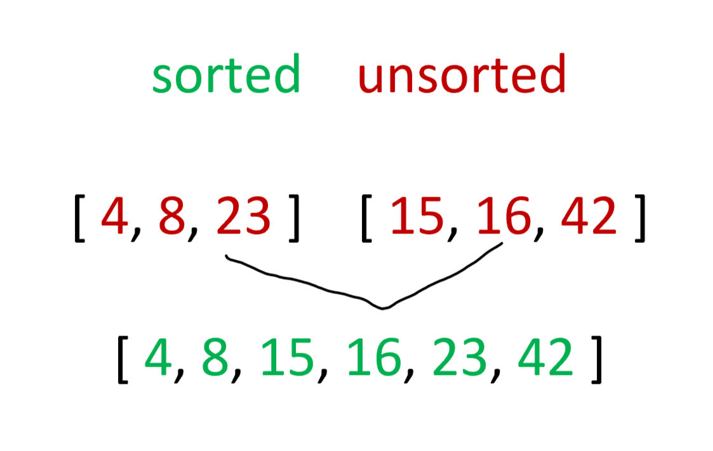

# Merge Sort Algorithm

*Author: Peyton Cysewski*

---

## Description
Merge sort is a recursive sorting algorithm. It breaks down a data set halving it until all the items are in their individual components before step by step combining them back together and sorting them as it goes.

---

## Big O

| Time | Space | Input | Outcome |
| :----------- | :----------- | :-------------: | :-------------: |
| O(nlogn) | O(n) | `[ 8, 4, 23, 42, 16, 15 ]` | `[ 4, 8, 15, 16, 23, 42 ]` |

---

## Visuals

### Array Division

 

### Recombination 1

 

### Recombination 2

 

### Recombination 3

---

## Change Log
1.1: *Initial Release* - 11 August 2020