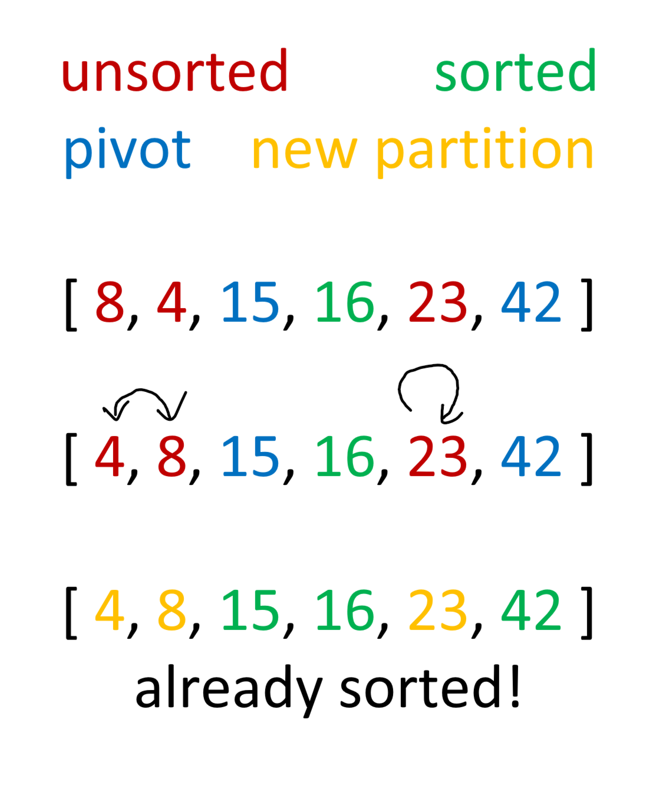

# Insertion Sort

Quick sort is a recursive algorithm that depends on something called the pivot. The way this works is by first choosing this pivot. The pivot ideally would be a number that is the median or close the the mediam number in an array. The pivot is then swapped with the right-most array index item. If not, then it is common to just choose the current right-most item as the starting pivot. Then two references look at numbers starting from both the right and the left sides of the array (excluding the right-most item that was set aside as the pivot). The reference that is on the left side moves to the right one at a time until it finds a number larger than the pivot. At the same time the reference on the right side moves left one at a time until it finds an item smaller than the pivot. Once both values are found, they are swapped. This cycle continues until the two references cross over one another signaling that all the values have been correctly placed on their respective sides. The pivot (on the far right) is then swapped back to its original position. Because the array has been rearranges around the pivot point, the pivot is now in the correct index postion relative to the entire array. This algorithm is then applied recursively until every item has been placed in the correct position and it is sorted.

### Partition 1

The first step chooses the rightmost item as the partition meaning it is the item that all the other items are compared to. As the algorithm iterates through, it finds that 23 is bigger than the pivot value and 15 is less than it, so it swaps the two. This is the only change that has to happen in the first level of recursion, so the pivot is put at the index one to the right of the value it is still bigger with, the value that was previously at that index goes to the end. In this case, it was 42 that was swapped with 16.

### Partition 2

This level of recursion sees the same algorithm applies to the subsections of the array that were partitioned around the previous pivot. Now these sections have their own pivots. The components are rearranged around the pivot values before the pivot is placed back where it belongs. Because this is a small array, it only needed two steps before it was fully sorted. Note: The algorithm would actually perform one more step because the partition of 4 and 8 is larger than 1 so it would apply the algorithm one more time even though they are already sorted.