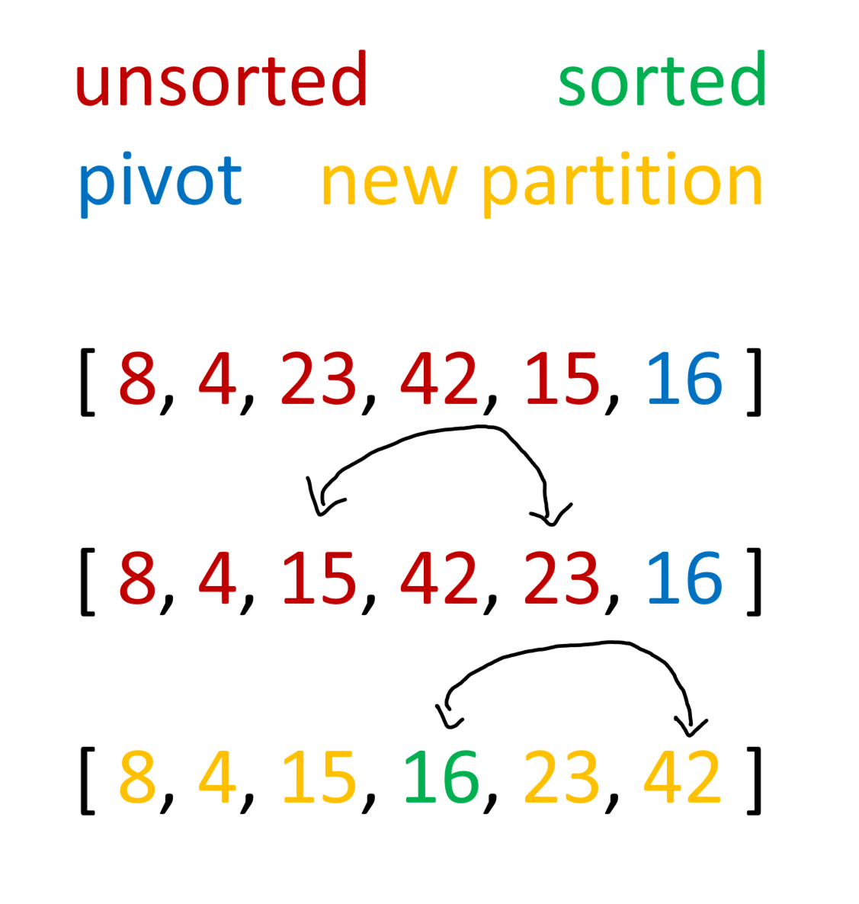
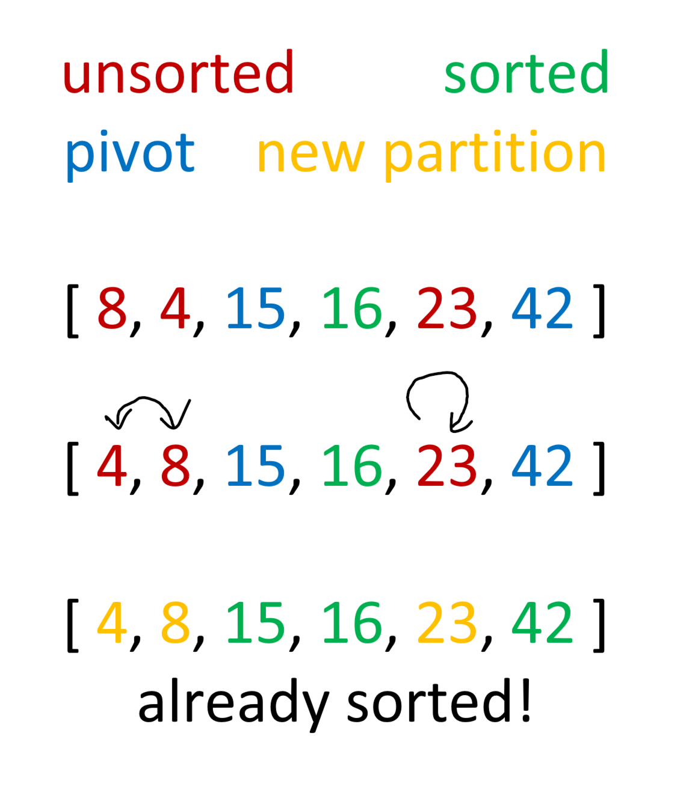

# Quick Sort Algorithm

*Author: Peyton Cysewski*

---

## Description
Quick sort is a recursive algorithm that depends on something called the pivot. The sorting is done relative to the pivot meaning that the pivot ends up being in the correct index overall. The algorithm ends up recursively breaking the list of numbers up into smaller and smaller partitions until each item is put in the correct place relative to more and more granular pivots. When the partitions are only one item large, then the algorithm is complete.

---

## Big O

| Time | Space | Input | Outcome |
| :----------- | :----------- | :-------------: | :-------------: |
| O(nlogn) | O(logn) | `[ 8, 4, 23, 42, 16, 15 ]` | `[ 4, 8, 15, 16, 23, 42 ]` |

---

## Visuals

### Recursive Partition 1

### Recursive Partition 2

---

## Change Log
1.2: *Repo Completed* - 15 August 2020
1.1: *Initial Release* - 13 August 2020