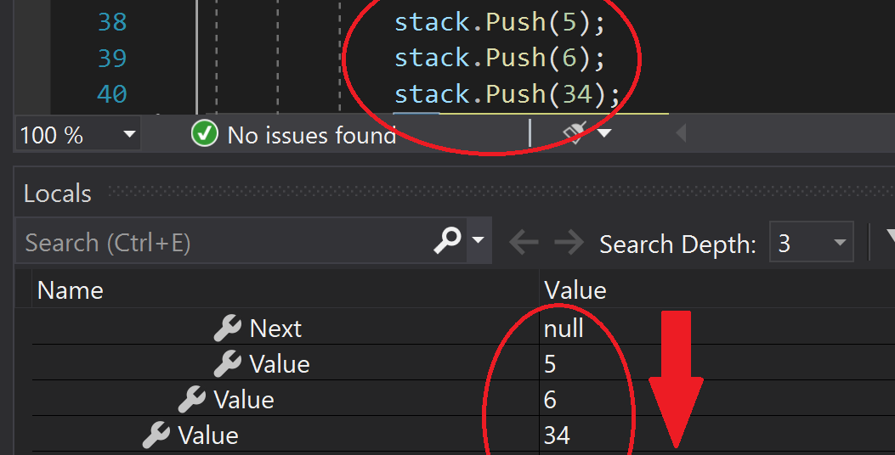
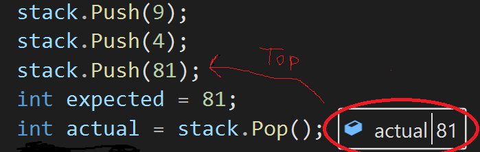
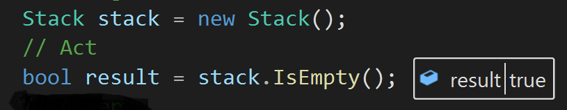
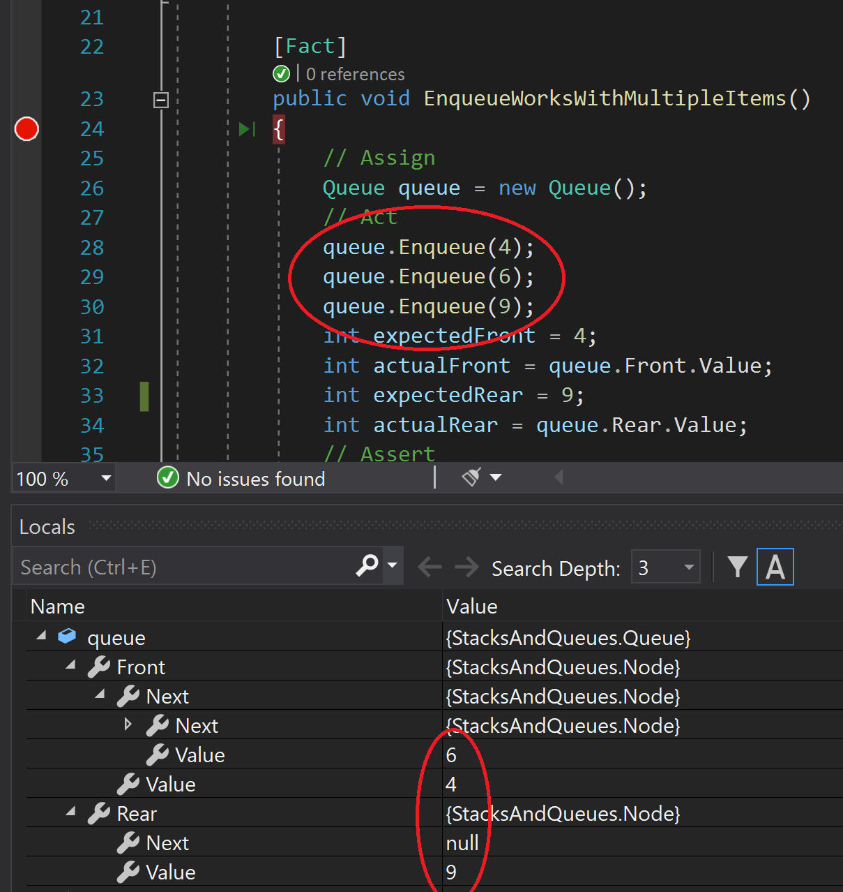
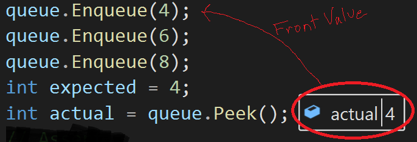
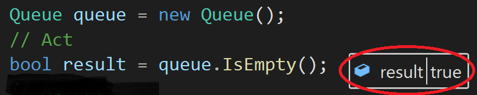

# Stacks and Queues

*Author: Peyton Cysewski*

---

## Description
### Stack
A stack is a data structure that works with FILO/LIFO ordering. The first item in is the last one to go. A stack is visualized by have a bunch of 'items' stacked vertically on top of one another. Once one item is popped off the the top, then you have access to the one directly beneath it. This is why the first item will be at the bottom and cannot be removed until everything else has been popped off first. The `Top` value of a stack is the item currently at the top that would be accessed next.

### Queue
A queue is a data structure that works with FIFO/LILO ordering. A queue is like a line of functions. The first function in line gets to go first, then the second, then the third, and so on. Once a new item or function joins the queue, it is essentially at the back of the line and only gets to the front of the line once everything in front of it has been run. The `Front` value of a queue is where an item is accessed next while any new items join at the `Rear`.

---

## Methods

### Stack
| Method | Summary | Big O Time | Big O Space | Example | 
| :----------- | :----------- | :-------------: | :-------------: | :----------- |
| Push | Adds a new `Node` to the `Top` of the `Stack` | O(1) | O(1) | myStack.Push(12) |
| Pop | Removes a new `Node` from the `Top` of the `Stack` | O(1) | O(1) | myStack.Pop() |
| Peek | Returns the value of the `Top` `Node` | O(1) | O(1) | myStack.Peek() |
| IsEmpty | Returns a boolean. True if the `Stack` is empty, false if not | O(1) | O(1) | myStack.IsEmpty() |

### Queue
| Method | Summary | Big O Time | Big O Space | Example | 
| :----------- | :----------- | :-------------: | :-------------: | :----------- |
| Enqueue | Adds a new `Node` to the `Rear` of the `Queue` | O(1) | O(1) | myQueue.Enqueue(34) |
| Dequeue | Removes a new `Node` fromt the `Front` of the `Queue` | O(1) | O(1) | myQueue.Dequeue() |
| Peek | Returns the value of the `Front` `Node` | O(1) | O(1) | myQueue.Peek() |
| IsEmpty | Returns a boolean. True if the `Queue` is empty, false if not | O(1) | O(1) | myQueue.IsEmpty() |

---

## Visuals

### Stack
#### Push Method
*The Push Method takes in an int as a parameter. A new Node is then created using the int param as its Value. The new Node is then placed in the Stack at the Top and the previous Top is assigned as the new Node's Next.*

#### Pop Method
*The Pop Method takes no parameters. The Value of the Top Node is returned. The popped Node's Next becomes the new Top Node.*

#### Peek Method
*The Peek Method takes not parameters. It returns the Value of the Top Node.*

#### IsEmpty Method
*The IsEmpty Method takes no parameters. It Returns a boolean depending on whether or not the Top Node is Null.*

### Queue
#### Enqueue Method
*The Enqueue Method takes in an int as a parameter. A new Node is then created using the int param as its Value. The new Node is then placed in the Stack at the Top and the previous Top is assigned as the new Node's Next.*

#### Dequeue Method
*The Dequeue Method takes no parameters. The Value of the Front Node is returned. The dequeued Node's Next becomes the new Front Node.*

#### Peek Method
*The Peek Method takes not parameters. It returns the Value of the Front Node.*

#### IsEmpty Method
*The IsEmpty Method takes no parameters. It Returns a boolean depending on whether or not the Front Node is Null.*

---

## Change Log
1.1: *Initial Release* - 20 July 2020  

---