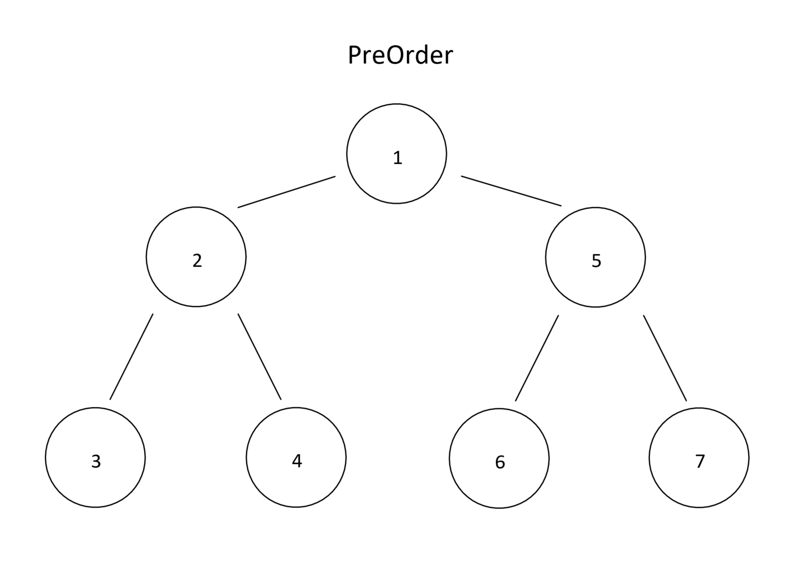
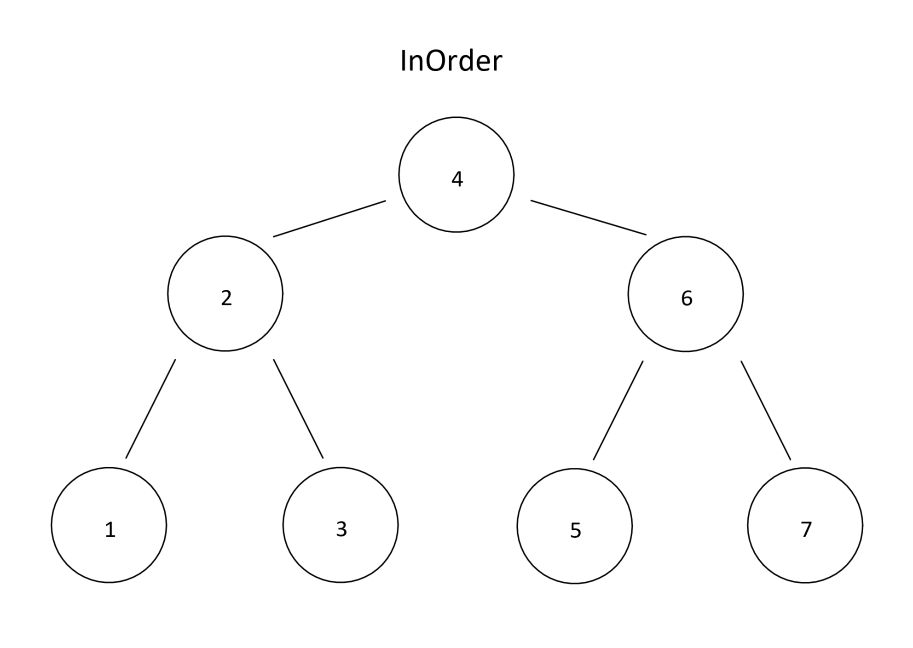
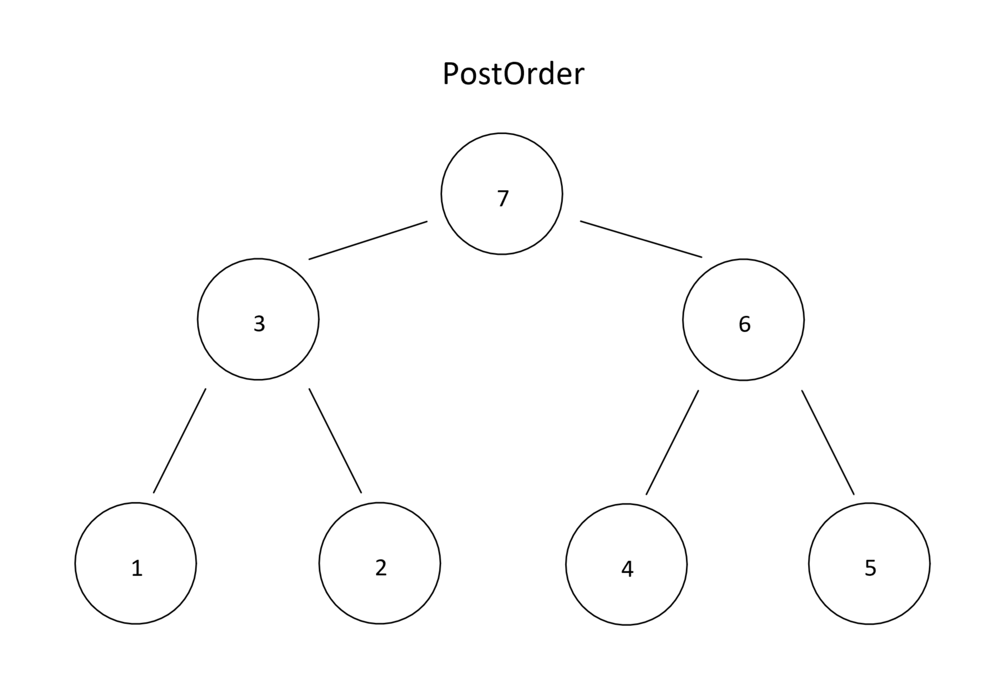
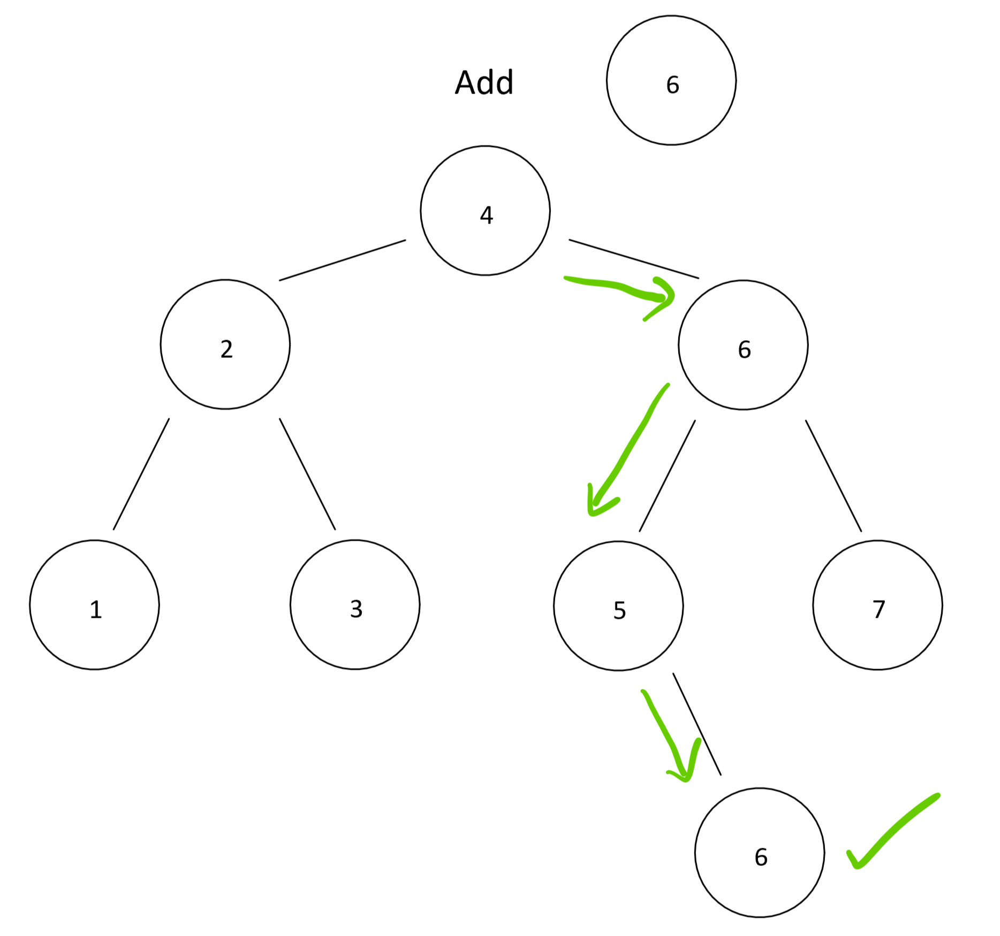
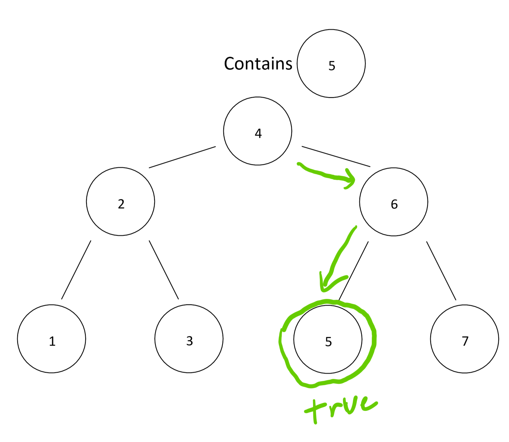

# Trees

*Author: Peyton Cyserwski*

---

## Description
Trees are data structures that have a sort of branching structure (hence the name) that relates one `Root` node to children nodes, usually a `LeftChild` and a `RightChild`. Traditionally, there are can be a maximum of exactly two children nodes per root node. Each of these children are roots to their own children. Because of this structure, there can be relationships between the parent and root nodes that can be exploited. For example, a Binary Search Tree puts values smaller than the root on the left and ones larger on the right. This means that there is a direct and organized route to every endpoint on a tree (know as leaves).

---

## Methods

| Method | Summary | Big O Time | Big O Space |
| :----------- | :----------- | :-------------: | :-------------: |
| PreOrder | Traverses through a tree odered by: Root, Left, Right | O(n) | O(1) |
| InOrder | Traverses through a tree odered by: Left, Root, Right | O(n) | O(1) |
| PostOrder | Traverses through a tree odered by: Left, Right, Root | O(n) | O(1) |
| Add | Traverses through a binary search tree and inserts a new value in the correct spot | O(logn) | O(1) |
| Contains | Traverses through a binary search tree and looks to see if a value exists at least one time | O(logn) | O(1) |

---

### PreOrder Method

*The PreOrder method of traversing through a tree looks at the root first before proceeding on to the root's left child and its right child. The diagram above shows the order in which the nodes will be ordered after traversing the tree with this method.*
### InOrder Method

*The InOrder method of traversing through a tree looks at the root's left child first before proceeding on to the root itself and then finally its right child. The diagram above shows the order in which the nodes will be ordered after traversing the tree with this method.*
### PostOrder Method

*The PostOrder method of traversing through a tree looks at the root's left child first before proceeding on to the root's left child and then finally the root itself. The diagram above shows the order in which the nodes will be ordered after traversing the tree with this method.*
### Add

*The binanry search tree add method takes the value being added to the tree and compares it to each node. If it is smaller than the current node then it traverses to the left child node before repeating the same step again. If it is larger than the node's value then it will traverse to the right child. If they are equal and it has not made its way to a leaf, then it will defer to traverse through the left child. Note: in most cases this has a O(logn) time efficiency, but it could be worse and potentially be a O(n).*
### Contains

*The binary search tree contains method traverses the tree just like the add method, going to the left or right child respective on whether the target value is less than or equal to the current node's value, or greater than it. If it traverses down a path to a leaf before finding a match, then it returns false. If it finds a match along the way, then it returns true.*

---

## Change Log
1.2 *Binary Search Tree Implementation Added* - 29 July 2020
1.1: *Initial Release* - 26 July 2020

---