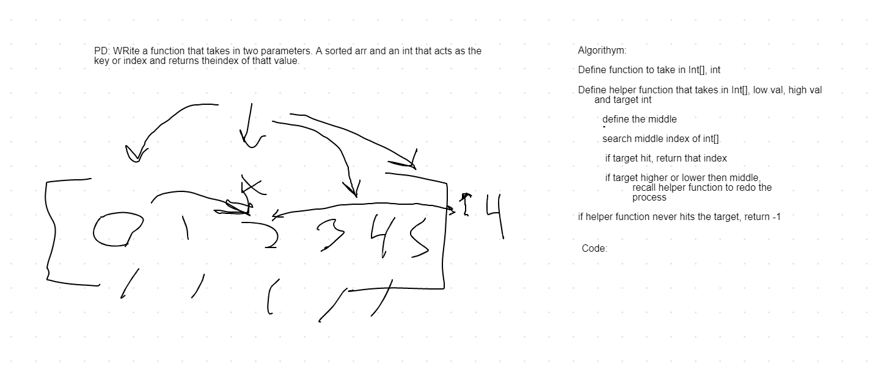

# Array Binary Search

*Author: Peyton Cysewski*

View the code [Here](../../../java/challenges/binarysearch/BinarySearch.java)

---

### Problem Domain

Write a function called BinarySearch which takes in 2 parameters: a sorted array and the search key. Without utilizing any of the built-in methods available to your language, return the index of the array’s element that is equal to the search key, or -1 if the element does not exist.

---

### Inputs and Expected Outputs

| Input | Expected Output |
| :----------- | :----------- |
| `[4,8,15,16,23,42], 15` | `	2` |
| `[11,22,33,44,55,66,77], 90` | `-1` |

---

### Big O

| Time | Space |
| :----------- | :----------- |
| O(logn) | O(logn) |

---

### Whiteboard Visual

---

### Change Log
1.0: *Initial Submission* - 16 September 2020  
