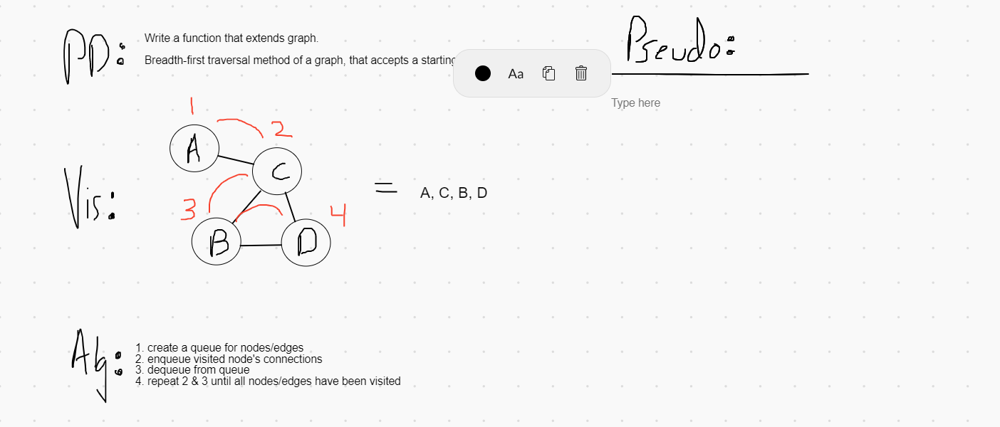

# Breadth First Graph Traversal

*Author: Peyton Cysewski*

---

### Problem Domain

Extend your graph object with a breadth-first traversal method that accepts a starting node. Without utilizing any of the built-in methods available to your language, return a collection of nodes in the order they were visited. Display the collection.

---

## Explanation

A breadth-first traversal is exactly the same as it is with a tree type data structure while the only caveat is the fact that graphs have the potential to be cyclical so you could theoretically traverse over the same node any number of times. To prevent this you have to keep track of what nodes have been visited prior. One way to do this that is destructive is to add a "visited" boolean flag to the node object, but we don't want a destructive solution. Instead, we use a hashset to track what has been visited by adding nodes to the set. This way there is no way to visit the same node more than one time.

---

### Big O

| Time | Space |
| :----------- | :----------- |
| O(n) | O(n) |

---

### Whiteboard Visual

---

### Change Log
1.0: *Initial Submission* - 2 November 2020  
