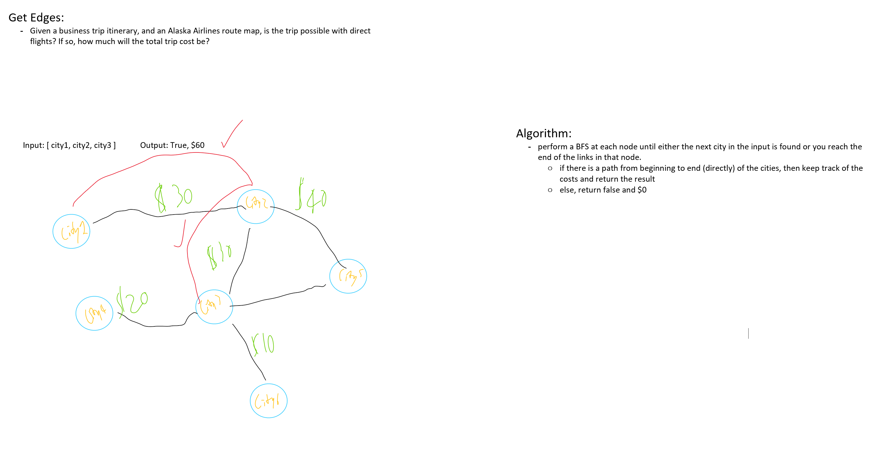

# Graph Get Edges

*Author: Peyton Cysewski*

---

### Problem Domain

- Given a business trip itinerary, and an Alaska Airlines route map, is the trip possible with direct flights? If so, how much will the total trip cost be?
- Write a function based on the specifications above, which takes in a graph, and an array of city names. Without utilizing any of the built-in methods available to your language, return whether the full trip is possible with direct flights, and how much it would cost.

---

## Explanation

To see if a certain path from one city (or node) to another is possible, you have to check through it's connections to see if it is there. The underlying question is asking for a direct connection or a series of direct connections between nodes. This can be broken down to checking one connection at a time as provided from the other side of the input that is a list of desired connections. If there is a connection, then you add the cost of the connection to a running total. If at any point there is an inconsistency or gap between connections then the default result is returned that signals that there is not infact a direct series of connections between nodes.

---

### Big O

| Time | Space |
| :----------- | :----------- |
| O(n^2) | O(n) |

---

### Whiteboard Visual

---

### Change Log
1.0: *Initial Submission* - 4 November 2020  
