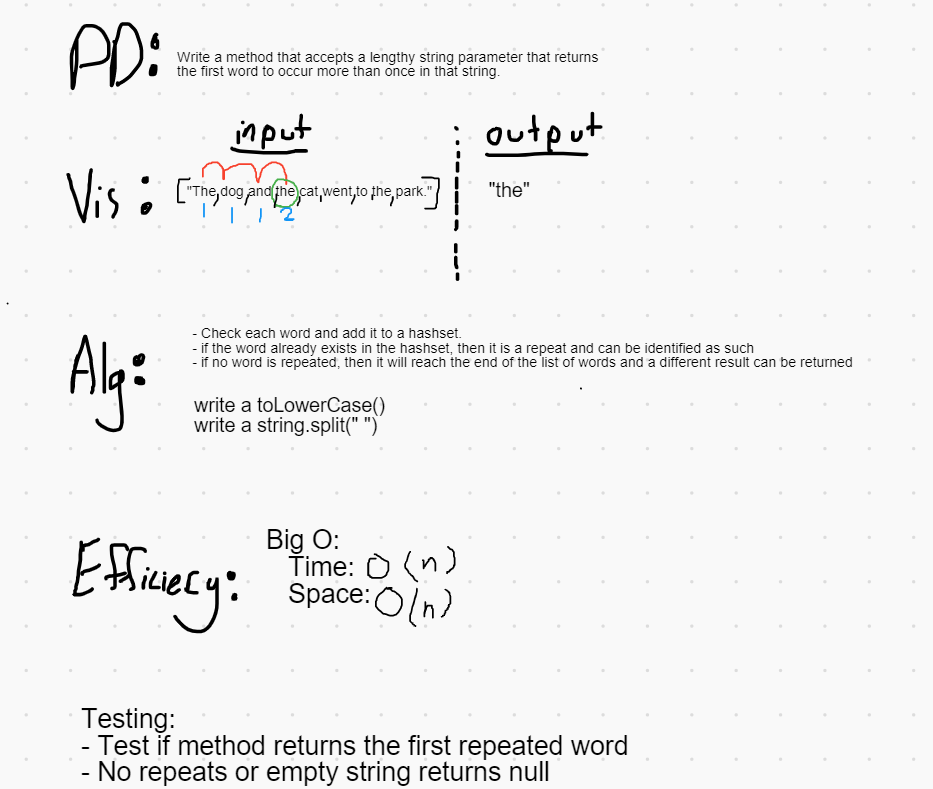

# Repeated Word

*Author: Peyton Cysewski*

---

### Problem Domain
Write a function that accepts a lengthy string parameter. Without utilizing any of the built-in library methods available to your language, return the first word to occur more than once in that provided string.

---

### Explanation
This challenge has two implementations. The first makes use of a hashset to store values as the method iterates through the array of strings. If a word is encountered that is already inside of hashset, then it is a repeat. The other implementation uses two for loops. The outer one iterates forward through the array while the inner one iterates backwards from the current position of the outer loop. If the two loops ever have a matching value, then it is a repeat.

---

### Inputs and Expected Outputs

| Input | Expected Output |
| :----------- | :----------- |
| `"Once upon a time, there was a brave princess who..."` | `"a"` |
| `"It was the best of times, it was the worst of times, it was the age of wisdom, it was the age of foolishness, it was the epoch of belief, it was the epoch of incredulity, it was the season of Light, it was the season of Darkness, it was the spring of hope, it was the winter of despair, we had everything before us, we had nothing before us, we were all going direct to Heaven, we were all going direct the other way – in short, the period was so far like the present period, that some of its noisiest authorities insisted on its being received, for good or for evil, in the superlative degree of comparison only..."` | `"it"` |
| `"It was a queer, sultry summer, the summer they electrocuted the Rosenbergs, and I didn’t know what I was doing in New York..."` | `"summer"` |

---

### Whiteboard Visual

---

### Change Log
1.0: *Initial Release* - 26 October 2020
