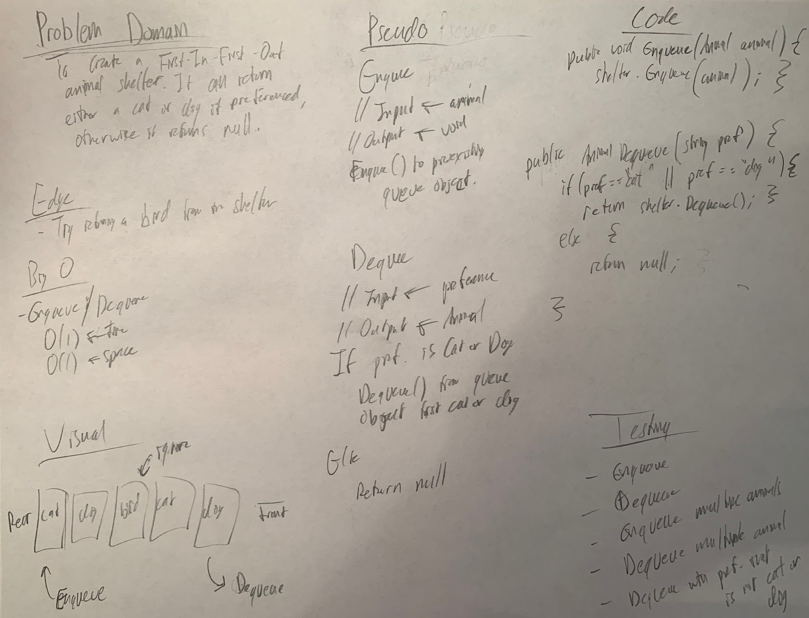

# FIFO Animal Shelter

*Author: Peyton Cysewski*

View the code [Here](../../../../java/challenges/utilities/AnimalShelter.java)

---

## Problem Domain

Create a class called `AnimalShelter` which holds only `Dogs` and `Cats`. The shelter operates using a first-in, first-out approach.

---

## Inputs and Expected Outputs

| Input | Expected Output |
| :----------- | :----------- |
| `shelter.enqueue(dog)` | `[dog]` |
| `shelter.dequeue("cat")` | `null` |

---

## Big O

| Method | Time | Space |
| :------- | :----------- | :----------- |
| Enqueue | O(1) | O(1) |
| Dequeue | O(n) | O(n) |

---

## Methods

### Enqueue
The enqueue method is able to add any animal to the shelter. In this case, only cats and dogs will be added.

### Dequeue
The dequeue method removes and returns an animal from the shelter. This is a FIFO operation and will return the first animal that was added to it. The method also takes an argument of preference that only works with the strings `"cat"` or `"dog"`. If there is a valid preference, then the first animal of that type will be removed and returned.

---

### Whiteboard Visual

---

### Change Log
1.1: *Added Visual* - 19 November 2020
1.0: *Initial Submission* - 29 September 2020  
