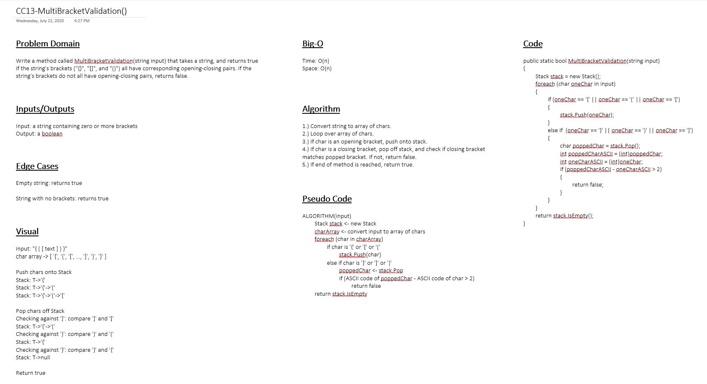

# Multi-Bracket Validation

*Author: Peyton Cysewski*

---

### Problem Domain
Take a string as its only argument, and return a boolean representing whether or not the brackets in the string are balanced. Balanced means that their are an equal number of the same types of opening and closing round, square, and curly brackets.

---

### Inputs and Expected Outputs

| Input | Expected Output |
| :----------- | :----------- |
| `{}` | `TRUE` |
| `{}(){}` | `TRUE` |
| `()[[Extra Characters]]` | `TRUE` |
| `(){}[[]]` | `TRUE` |
| `{}{Code}[Fellows](())` | `TRUE` |
| `[({}]` | `FALSE` |
| `(](` | `FALSE` |
| `{(})` | `FALSE` |

---

### Big O

| Time | Space |
| :----------- | :----------- |
| O(n) | O(n) |

---

### Whiteboard Visual

---

### Change Log
1.1: *Added Visuals* - 19 November 2020
1.0: *Initial Release* - 1 October 2020  

---