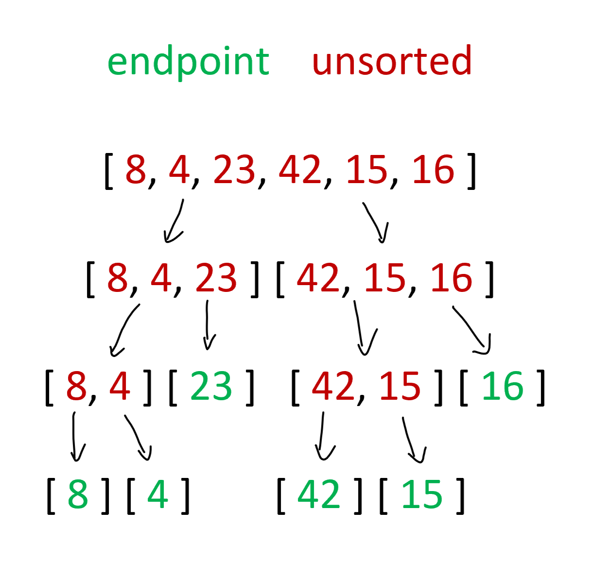
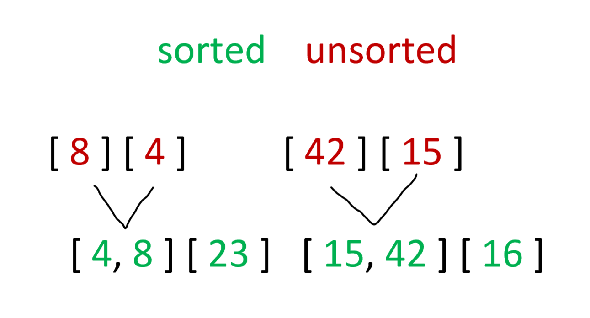
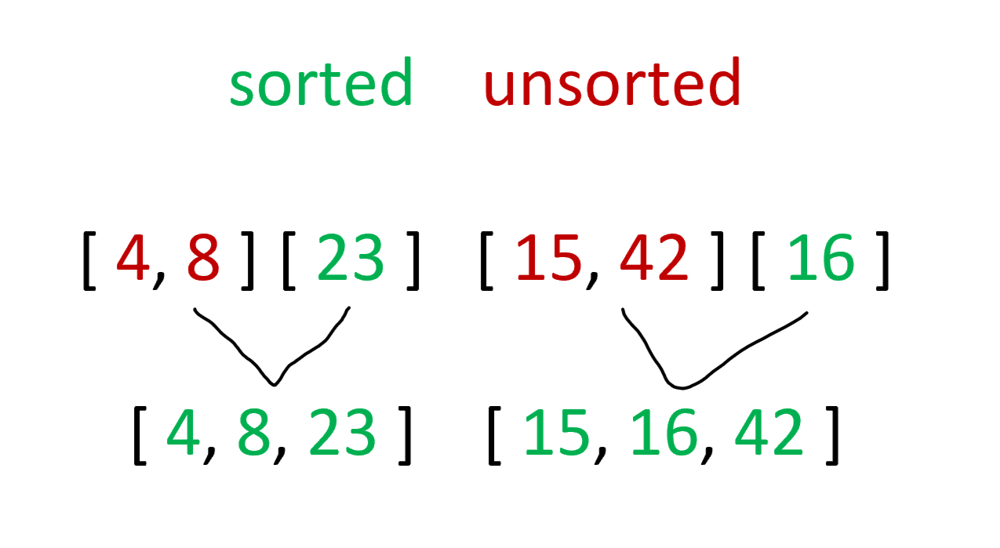
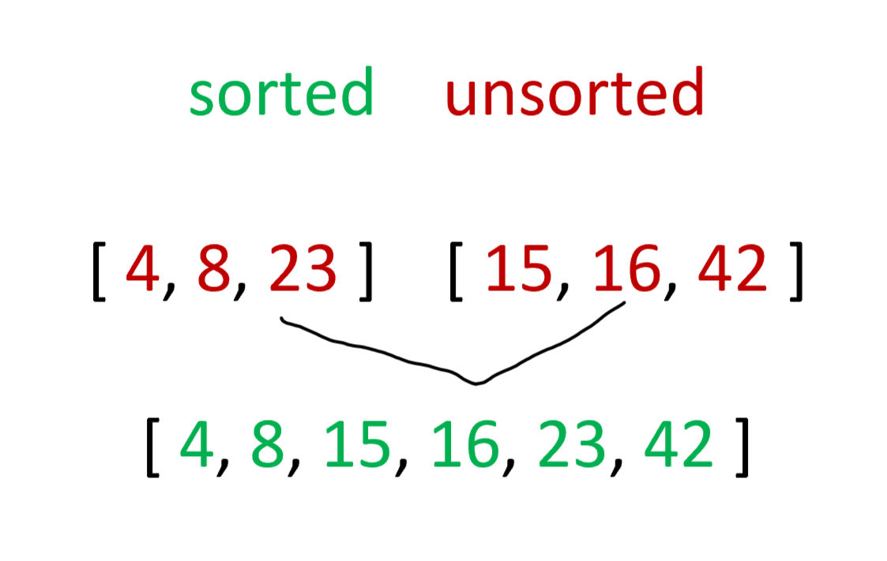

# Merge Sort

View the code [Here](../../../java/dsas/mergesort/MergeSort.java)

## Explanation
The merge sort algorithm is recursive in nature. This is important to know right away because it drives the behavior and Big O of the algorithm. If merge sort is applied to an array of numbers, it starts by dividing the array in half to smaller and smaller numbers. In cases of odd numbered lengths then the left side of the array will be one larger than the right side. This pattern recursively breaks down the array into its individual components. Drawing this out would resemble a binary tree. Each of these components is then put back together in the correct order, comparing items from left to right, adding them in order from smallest to largest back into the array of the next size up until the whole thing is recompiled together, fully sorted. At any point where two smaller arrays are being put back together if one array reaches its end first, then the remaining items are imediately put into the array since they would already be sorted from the iteration before. The diagrams below highlight this process of indirect recursion.

### Array Division

The array is broken down in a recursive manner where the first array is broken in half and each subsequent half is broken in half (or roughly half) again and again until each individual part is standing on its own. Notice how on the second to last division the 23 and the 16 stand alone and don't move any further down. Since the method is called recursively, they will be factored back in when the algorithm reaches their level on the way back to complete combination.

### Combination 1

At this level, only the bottom two sets are recombined back in order. The diagram indicates that they start out unsorted, yet this is purelty semantic as an individual item is technically always sorted when it stands alone.

### Combination 2

The second combination adds back in the 23 and the 16 to the combined arrays. In the recursive call stack they are rejoined at the same level that they were split apart.

### Combination 3

The final level takes the two arrays that are equally half the length of the full size array, comparing each value until they are added back into a fully ordered array containing all of the original integers.
