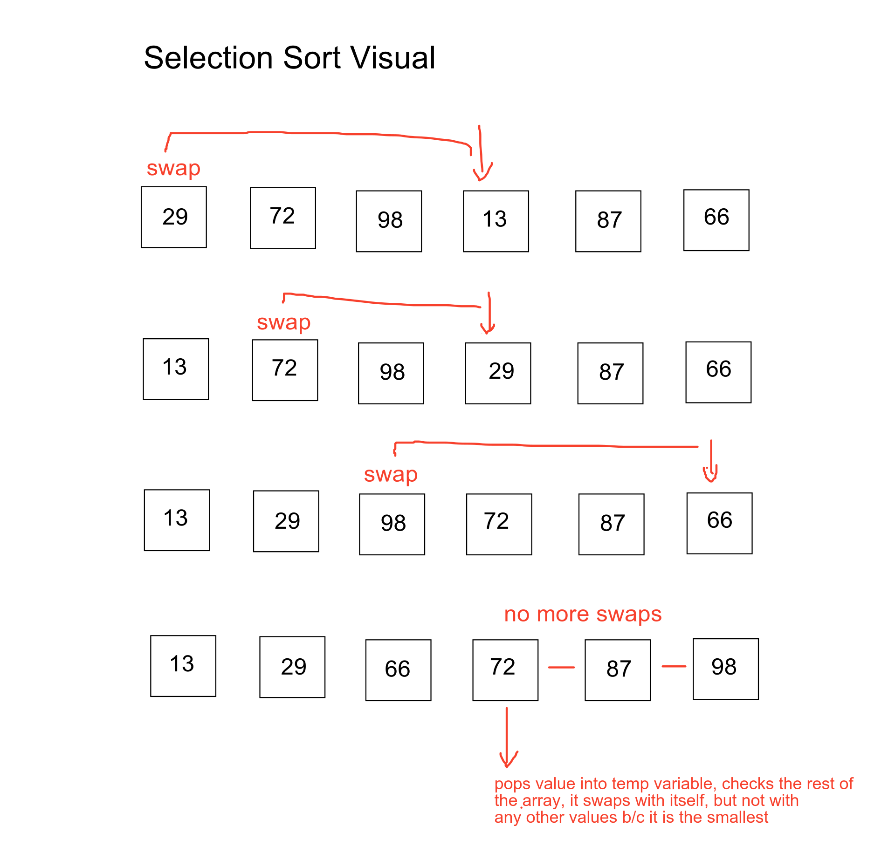

# Selection Sort

View the code [Here](../../../java/dsas/selectionsort/SelectionSort.java)

## Explanation
Selection sort is a sorting algorithm that increments one index at a time, finding the smallest (or largest) 
remaining value to the right (or left) of the current index. By the time the algorithm is all the way through the array, 
then it will be sorted. Below is a diagram of how this algorithm works, stepped through each iteration.

## Additional Notes
This code base has two variations of the algorithm. The second method called `sort2` works the same way the diagram shows. The first 
method called `sort1` works slightly differently. Instead of looking to the right of the index to find the smallest remaining value, this 
algorithm looks to the left of the index and grabs the first value that is large than the index. This method ensures that as the index 
moves through the array, every value to the left of the current index is gauranteed to be sorted.
