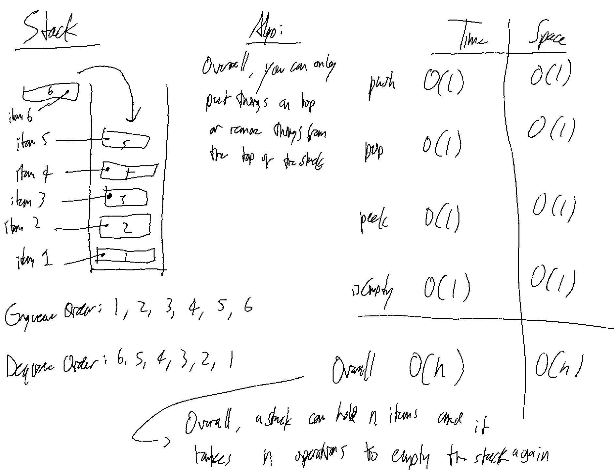
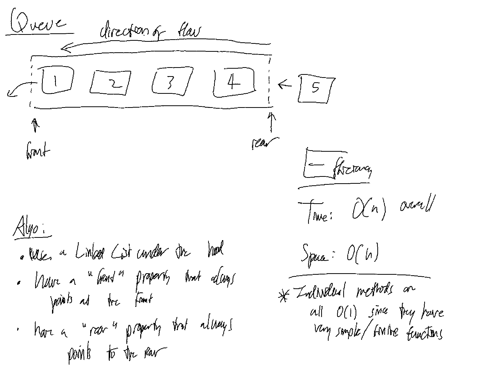
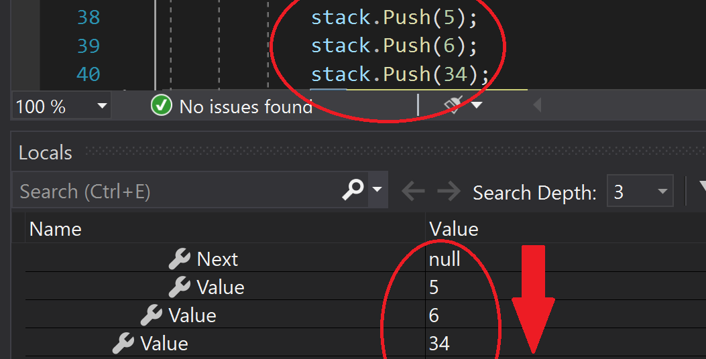
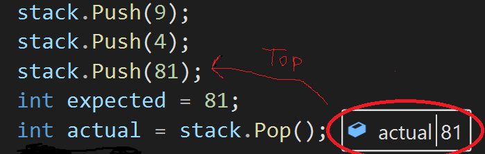
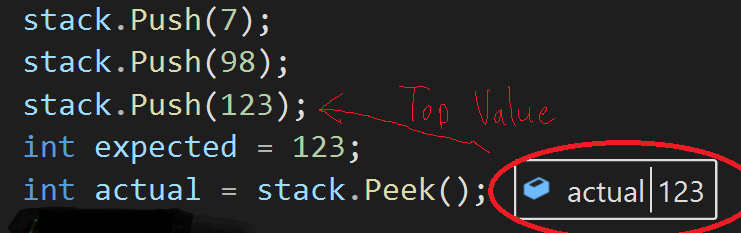
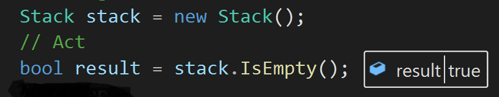
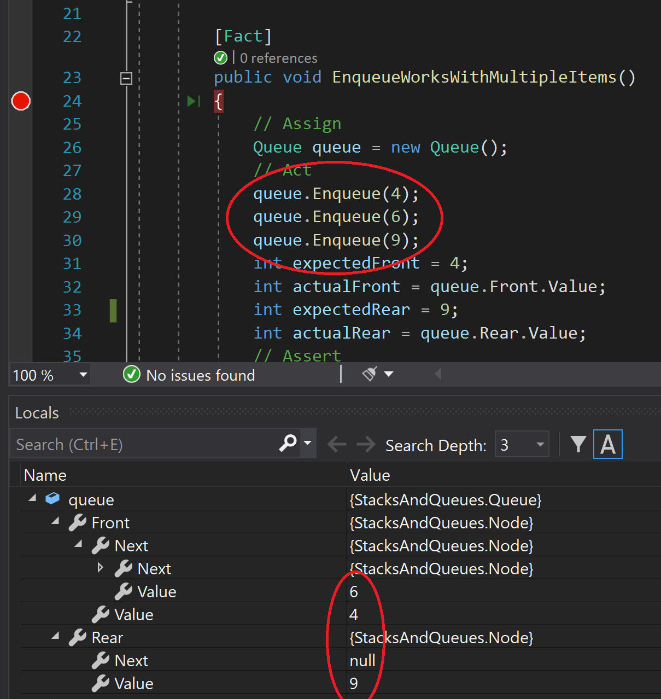
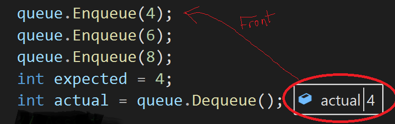
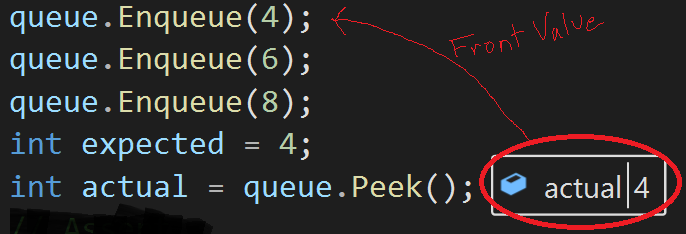
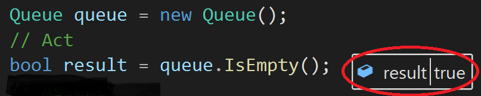

# Stacks and Queues

*Author: Peyton Cysewski*

View the code [Here](../../../java/dsas/stacksandqueues)

---

## Description

A Java implementation of a `Stack` and `Queue`. Stacks and Queues both contain individual nodes that have a reference to the `Next` node in the collection type as well as a `Value`. The methods and properties of the `Stack` are `top`, `push()`, `pop()`, `peek()`, and `isEmpty()`. The methods and properties of the `Queue` are `front`, `enqueue()`, `dequeue()`, `peek()`, and `isEmpty()`. This Stack and Queue are both generic, meaning that they can hold any data type that is specified upon instantiation.

---

## Methods

### Stack
| Method | Summary | Big O Time | Big O Space | Example | 
| :----------- | :----------- | :-------------: | :-------------: | :----------- |
| push | Adds a new value to the Stack | O(1) | O(1) | myStack.push(99) |
| pop | Returns and removes the Stack's top value | O(1) | O(1) | myStack.pop() |
| peek | Returns the Stack's top value | O(1) | O(1) | myStack.peek() |
| isEmpty | Indicates whether the Stack is empty or not | O(1) | O(1) | myStack.isEmpty() |

### Queue
| Method | Summary | Big O Time | Big O Space | Example | 
| :----------- | :----------- | :-------------: | :-------------: | :----------- |
| enqueue | Adds a new value to the Queue | O(1) | O(1) | myStack.enqueue(99) |
| dequeue | Returns and removes the Queue's front value | O(1) | O(1) | myStack.dequeue() |
| peek | Returns the Queue's front value | O(1) | O(1) | myStack.peek() |
| isEmpty | Indicates whether the Queue is empty or not | O(1) | O(1) | myStack.isEmpty() |

---

## Whiteboards

### Stack

### Queue

---

## Methods and Visuals
***Note*** Visuals adapted from a C# implementation that uses similar code and functions in a similar way.

### Stack
#### Push Method
*The Push Method takes in an int as a parameter. A new Node is then created using the int param as its Value. The new Node is then placed in the Stack at the Top and the previous Top is assigned as the new Node's Next.*

#### Pop Method
*The Pop Method takes no parameters. The Value of the Top Node is returned. The popped Node's Next becomes the new Top Node.*

#### Peek Method
*The Peek Method takes not parameters. It returns the Value of the Top Node.*

#### IsEmpty Method
*The IsEmpty Method takes no parameters. It Returns a boolean depending on whether or not the Top Node is Null.*

### Queue
#### Enqueue Method
*The Enqueue Method takes in an int as a parameter. A new Node is then created using the int param as its Value. The new Node is then placed in the Stack at the Top and the previous Top is assigned as the new Node's Next.*

#### Dequeue Method
*The Dequeue Method takes no parameters. The Value of the Front Node is returned. The dequeued Node's Next becomes the new Front Node.*

#### Peek Method
*The Peek Method takes not parameters. It returns the Value of the Front Node.*

#### IsEmpty Method
*The IsEmpty Method takes no parameters. It Returns a boolean depending on whether or not the Front Node is Null.*

---

## Change Log
1.1: *Added Visuals* - 19 November 2020
1.0: *Initial Release* - 27 Sept 2020