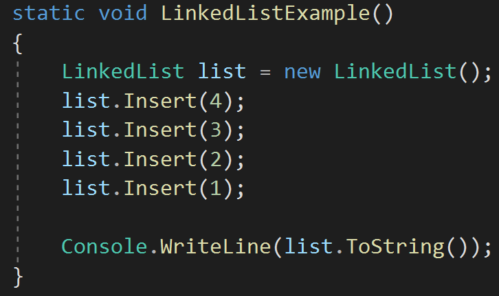
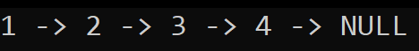

# Code Challenge 05

## ArrayShift
*Author: Peyton Cysewski*

---

### Problem Domain

Implement a singly-linked linked list and have its implementation stored in a library for future use.

---

### Inputs and Expected Outputs

| Input Code | Console Output |
| :----------- | :----------- |
| ```list.Insert(4);``` | N/A |
| ```list.Insert(3);``` | N/A |
| ```list.Insert(2);``` | N/A |
| ```list.Insert(1);``` | N/A |
| ```list.ToString();``` | 1 -> 2 -> 3 -> 4 -> NULL |


---

### Big O for Looking Through a Linked List


| Time | Space |
| :----------- | :----------- |
| O(n) | O(n) |


---


### Implementation Visual
Code to add to the linked list:


Console Output Demonstrated:



---

### Change Log
1.1: *Initial Release* - 12 July 2020  

---