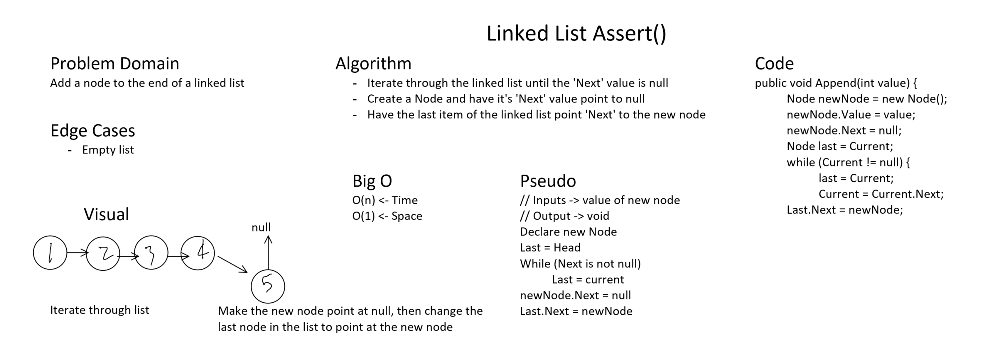
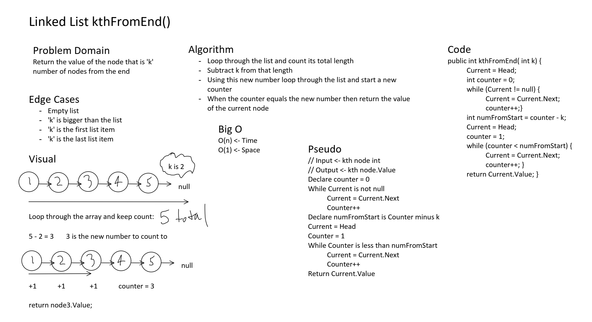

# Code Challenge 05 + 06 + 07

## LinkedList
*Author: Peyton Cysewski*

---

### Problem Domain

Implement a singly-linked linked list and have its implementation stored in a library for future use.

---


### Approach & Efficiency

This challenged was done as a class so the approach was simply to get it done. Our instructor primarily guided us along as we filled in the blanks. The goal was simply to make it work. Singly linked lists have a few characteristics such as having a value and then a reference to the next node in the list, so that is what we implemented.

The next part was adding a few more methods. These include adding nodes to the end of the array or into the middle of the array either before or after a desired value. The approaches were all very similar and involved iterating through lists of unknown length using a while loop. Once a certain value is detected then the methods will perform their specific variation on inserting a new node into the list.

For the 


---


### API

- ```Insert()``` - Adds a new node to the front of the list (replacing and becoming the new ```Head```).
- ```Includes()``` - Looks through the list for a value and returns a boolean.
- ```ToString()``` - Overrides the native method and returns a list of the values, in order, with a '->' separating each value.
- ```Append()``` - Adds a new node to the end of the linked list.
- ```InsertBefore()``` - Searches for a desired value and inserts a new node directly in front of the node with the desired value.
- ```InsertAfter()``` - Searches for a desired value and inserts a new node directly after the node with the desired value.
- ```kthFromEnd()``` - Takes in an integer and finds the value of the node that is 'k' number of nodes from the end.


---


### Inputs and Expected Outputs

For ```Insert()```
| Input Code | Console Output |
| :----------- | :----------- |
| ```list.Insert(4);``` | ```4 -> NULL``` |
| ```list.Insert(3);``` | ```3 -> 4 -> NULL``` |
| ```list.Insert(2);``` | ```2 -> 3 -> 4 -> NULL``` |
| ```list.Insert(1);``` | ```1 -> 2 -> 3 -> 4 -> NULL``` |

For ```ToString()```
| Input Code | Console Output |
| :----------- | :----------- |
| ```1 -> 2 -> 3 -> 4 -> 5 -> NULL``` | <- Pre-existing Linked List |
| ```list.ToString();``` | To Console: ```1 -> 2 -> 3 -> 4 -> 5 -> NULL``` |

For ```Includes()```
| Input | Args | Output |
| :---- | :---- | :---- |
| ```1 -> 2 -> 3 -> 4 -> 5 -> NULL``` | ```5``` | ```True``` |
| ```1 -> 2 -> 3 -> 4 -> 5 -> NULL``` | ```10``` | ```False``` |

For ```Append()```
| Input | Args | Output |
| :---- | :---- | :---- |
| ```1 -> 2 -> 3 -> 4 -> 5 -> NULL``` | ```10``` | ```1 -> 2 -> 3 -> 4 -> 5 -> 10 -> NULL``` |
| ```1 -> NULL``` | ```5``` | ```1 -> 5 -> NULL``` |

For ```InsertBefore()```
| Input | Args | Output |
| :---- | :---- | :---- |
| ```1 -> 2 -> 3 -> 4 -> 5 -> NULL``` | ```3, 10``` | ```1 -> 2 -> 10 -> 3 -> 4 -> 5 -> NULL``` |
| ```1 -> 2 -> 3 -> 4 -> 5 -> NULL``` | ```1, 10``` | ```10 -> 1 -> 2 -> 3 -> 4 -> 5 -> NULL``` |
| ```1 -> 2 -> 3 -> 4 -> 5 -> NULL``` | ```0``` | ```Exception``` |

For ```InsertAfter()```
| Input | Args | Output |
| :---- | :---- | :---- |
| ```1 -> 2 -> 3 -> 4 -> 5 -> NULL``` | ```3, 10``` | ```1 -> 2 -> 3 -> 4 -> 5 -> NULL``` |
| ```1 -> 2 -> 3 -> 4 -> 5 -> NULL``` | ```5, 10``` | ```1 -> 2 -> 3 -> 4 -> 5 -> 10 -> NULL``` |
| ```1 -> 2 -> 3 -> 4 -> 5 -> NULL``` | ```6``` | ```Exception``` |

For ```kthFromEnd()```
| Input | Args | Output |
| :---- | :---- | :---- |
| ```1 -> 2 -> 3 -> 4 -> 5 -> NULL``` | ```2``` | ```3``` |
| ```1 -> 2 -> 3 -> 4 -> 5 -> NULL``` | ```0``` | ```5``` |
| ```1 -> 2 -> 3 -> 4 -> 5 -> NULL``` | ```6``` | ```Exception``` |


---


### Big O for Looking Through a Linked List

| Time | Space |
| :----------- | :----------- |
| O(n) | O(1) |


---


### Visuals

#### Insert Method
##### Code to add to the linked list:

##### Console Output Demonstrated:


#### Append Method
##### Whiteboard


#### K'th from the End Method
##### Whiteboard


---

### Change Log
- 1.1: *Initial Release* - 12 July 2020
- 1.2: *Added Append(), InsertBefore(), and InsertAfter() methods* - 13 July 2020
- 1.3: *Added kthFromEnd() method* - 14 July 2020

---